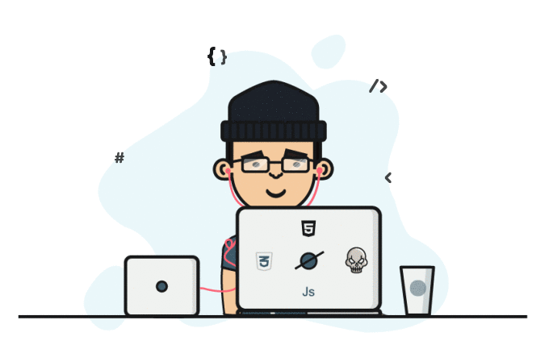

## Welcome to my Github profile!
<h4>I'm Shovon, Frontend developer from  <strong>Dhaka, Bangladesh.</strong></h4>

### Connect with me:
 
 
<!--  -->

### Languages and Tools:
 
 
 

 
 
 
  
 
 

<!-- ### GitHub Stats: -->

<!--   -->
 
<!--  -->
